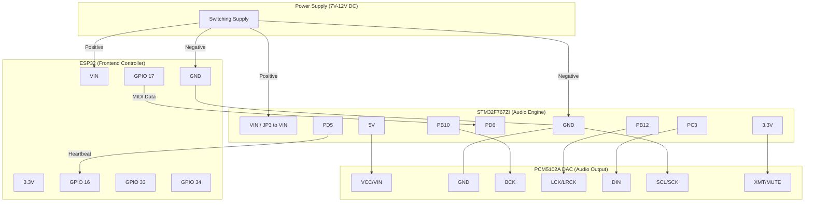

# 🔌 Project Piano: Comprehensive Wiring Diagram

เอกสารฉบับนี้รวบรวมการเชื่อมต่อทางฮาร์ดแวร์ทั้งหมดของระบบ โดยอ้างอิงตามโค้ดปัจจุบัน (V5.8 Arctic Edition)

---

## 📊 System Architecture (Mermaid)

---

## 📋 Detailed Pin Mapping

### 1. 🎹 Keyboard Matrix (MC14051 Mux x2)
| Function | Mux Pin | Connect to | Note |
| :--- | :--- | :--- | :--- |
| **Row Addr A** | 11 | **ESP32 GPIO 21** | LSB |
| **Row Addr B** | 10 | **ESP32 GPIO 13** | |
| **Row Addr C** | 9 | **ESP32 GPIO 14** | MSB |
| **Row COM** | 3 | **ESP32 3.3V** | Source Supply |
| **Col Addr A** | 11 | **ESP32 GPIO 25** | LSB |
| **Col Addr B** | 10 | **ESP32 GPIO 26** | |
| **Col Addr C** | 9 | **ESP32 GPIO 27** | MSB |
| **Col COM** | 3 | **ESP32 GPIO 33** | **Read Signal** |
| **GND Common** | 6, 7, 8 | **GND** | INH, VEE, VSS |

### 2. 📺 TFT Display & Touch (SPI)
| TFT Pin | ESP32 Pin | Note |
| :--- | :--- | :--- |
| **VCC** | **3.3V** | **CRITICAL: DO NOT USE 5V** |
| **GND** | **GND** | |
| **CS** | GPIO 5 | |
| **RESET** | GPIO 4 | |
| **DC/RS** | GPIO 2 | |
| **MOSI** | GPIO 23 | |
| **SCK** | GPIO 18 | |
| **LED** | GPIO 32 | PWM Dimming |
| **T_CS** | GPIO 15 | Touch CS |
| **T_DO** | GPIO 19 | MISO (For Watchdog) |

### 3. 📡 Inter-Board Comms (UART)
| ESP32 Pin | STM32 Pin | Function |
| :--- | :--- | :--- |
| **GPIO 17 (TX2)** | **PD6 (RX2)** | MIDI Out |
| **GPIO 16 (RX2)** | **PD5 (TX2)** | Status In |
| **GND** | **GND** | **MUST CONNECT** |

### 4. 🔊 Audio Path (I2S)
| STM32 Pin | DAC Pin | Function |
| :--- | :--- | :--- |
| **5V (Morpho)** | **VIN** | Power DAC |
| **PB10** | **BCK** | Bit Clock |
| **PB12** | **LRCK** | Word Select |
| **PC3** | **DIN** | Data |
| **GND** | **SCL (SCK)** | **Internal PLL Enable** |
| **3.3V** | **XMT (MUTE)**| **Unmute (High)** |

---

## ⚠️ Important Safety & Stability Notes

1. **Common Ground:** GND ทุกจุดต้องเชื่อมต่อถึงกัน สัญญาณถึงจะนิ่ง
2. **Matrix Noise:** หากพบคอลัมน์เลขคี่ (1,3,5,7) ติดเอง ให้ต่อตัวต้านทาน **10k Ohm** ระหว่าง **GPIO 33 และ GND**
3. **Display Power:** ขา VCC ของจอต้องต่อกับ **3.3V** เท่านั้น การต่อกับ VIN (7V-12V) จะทำให้จอพังทันที
4. **DAC Setup:** ขา **SCL** ต้องลงดิน และขา **XMT** ต้องไป 3.3V เท่านั้นเสียงถึงจะออก
